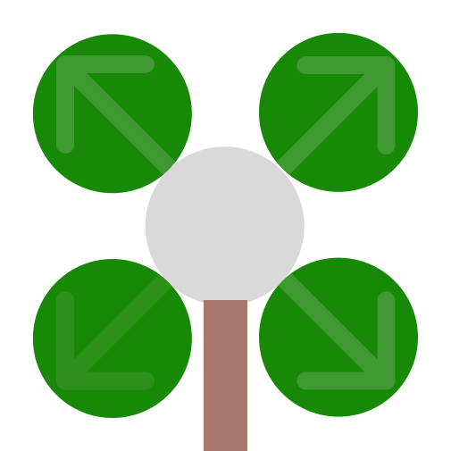

# Mono Carbon



**Asset Backed NFT Market  & Collateralized Carbon Credit Exchange**


## Development

```shell
npx hardhat help
npx hardhat test
REPORT_GAS=true npx hardhat test
npx hardhat node
npx hardhat run scripts/deploy.js
```

## Latest Addresses of Contracts 
```
MonoCarbon contract: 0x1BCFc6D371fD0BA1DeB2D8E1560ED2f1962be396
Certificate contract: 0x5B9E41A58f1372c5Ae2bdFD82329C1D23Eee03cA
CarbonMarket contract: 0x67dEd794aC8d07696db27eC3dAdbf02723B88456
UniswapV2Factory contract: 0xa70b4Bd26ae34e2ff613bCEc2487821A345F16d4
UniswapV2Router contract: 0xA083F8a2d17170a3a78291F9d67E3af34cAda8dD
```